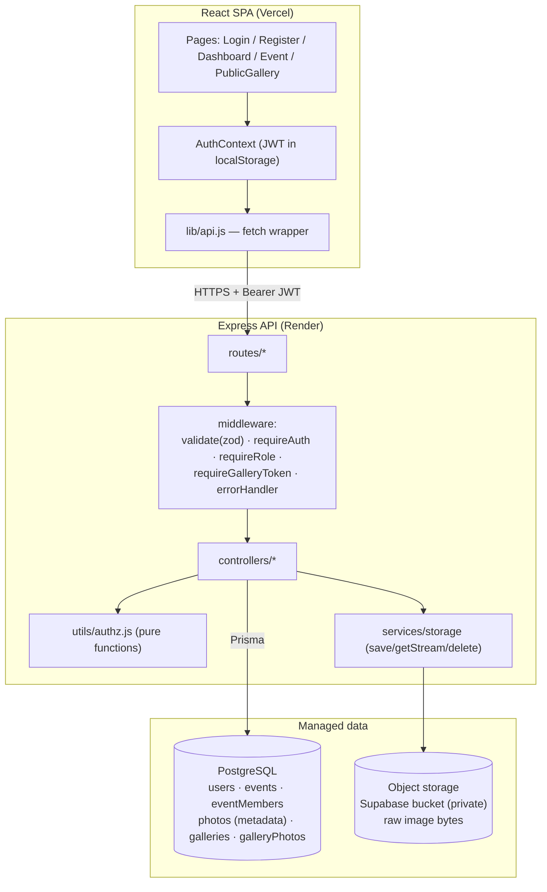
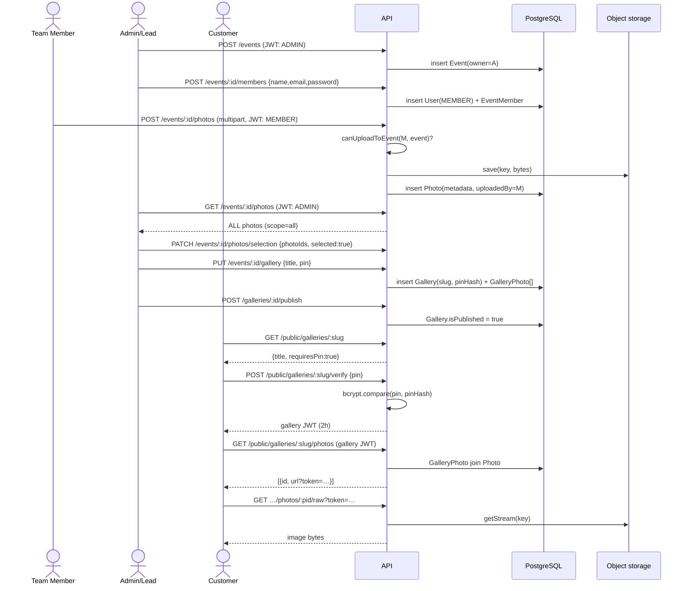

# Architecture

## Component diagram

## Sequence: team member uploads, admin publishes, customer views

## Why these boundaries

- **Pure `authz.js`** — every "who can do what" rule is a small function with no
  Express or Prisma import, so the rules are unit-tested exhaustively and the
  controllers stay readable.
- **Storage interface** — controllers never import a cloud SDK. Swapping local
  disk for Supabase (or S3 later) is one new file + one env var.
- **Metadata in SQL, bytes in a bucket** — the DB stays small and queryable; the
  bucket is private and images are proxied through an access check so no
  public/guessable object URL exists.
- **Separate gallery token** — a customer never receives a user session; the
  gallery JWT is scoped to a single slug and expires quickly.
